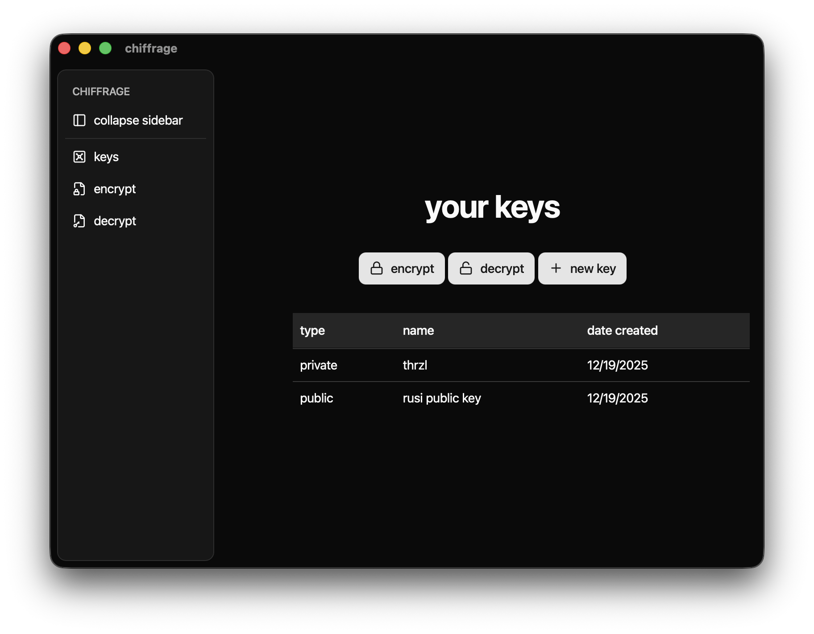

<!--
*** from https://github.com/othneildrew/best-readme-template
-->

<!-- project logo -->
 

  

  <h3 align="center"><b>chiffrage</b></h3>

  

    a desktop UI for age encryption.
     
    <!-- until i get the wiki together
        <a href="#"><strong>explore the docs »</strong></a> 
     
    -->
    <!--   -->
    <!-- until i get a demo together too (i guess)
    <a href="https://github.com/thrzl/chiffrage">view demo</a>
    ·-->
    <a href="https://github.com/thrzl/chiffrage/issues">report bug</a>
    ·
    <a href="https://github.com/thrzl/chiffrage/issues">request feature</a>
      <b>download for...</b> 
    <a href="https://latest.thrzl.xyz/thrzl/chiffrage?q=setup.exe">windows .exe</a>
    ·
    <a href="https://latest.thrzl.xyz/thrzl/chiffrage?q=aarch64.dmg">macOS .dmg (ARM/M-series)</a>
    ·
    <a href="https://latest.thrzl.xyz/thrzl/chiffrage?q=x64.dmg">macOS .dmg (x64)</a>
    ·
    <a href="https://latest.thrzl.xyz/thrzl/chiffrage?q=.AppImage">linux .AppImage</a>
     <i>note: these download links go to https://latest.thrzl.xyz, which simply redirects to the latest appropriate github release asset. feel free to verify hashes. more formats (.msi, .rpm, .deb, .app) are available on the release page.</i>
  

<!-- table of contents -->

  
table of contents

  <ol>
    <li><a href="#built-with">built with</a></li>
    <li><a href="#installation">installation</a></li>
    <li><a href="#usage">usage</a></li>
    <li><a href="#roadmap">roadmap</a></li>
    <li><a href="#contributing">contributing</a></li>
    <li><a href="#license">license</a></li>
    <li><a href="#acknowledgements">acknowledgements</a></li>
  </ol>

<!-- about the project -->

### built with

* [rage](https://github.com/str4d/rage)
* [tauri](https://tauri.app/)
* [sveltekit](https://svelte.dev/)
* [shadcn-svelte](https://www.shadcn-svelte.com/)

<!-- getting started -->

## installation
 
download the appropriate installer from the [latest release](https://github.com/thrzl/chiffrage/releases/latest).

### **windows**
windows users can install either the `chiffrage_x.x.x_x64-setup.exe` or `chiffrage_x.x.x_x64_en_US.msi` file.

### **macOS**

#### **silicon macs (M series)**
you should use the `chiffrage-aarch64.app.zip` or `chiffrage_x.x.x_aarch64.dmg`.

#### **x64 macs**
you should use the `chiffrage-x86_64.app.zip` or `chiffrage_x.x.x_x64.dmg`.

### **linux**
deb, rpm, and AppImage packages are all available for x64.

<!-- usage examples -->
## usage

a **keypair** consists of a **public** and **private** key. a file encrypted to public key `A` will be decryptable by private key `A`. therefore, to have someone else encrypt files to you, you simply have to share your public key.

encrypting files to yourself works the same way; simply add yourself as a recipient.
<!--_for more examples, [read da docs](docs/vertigo.md)_-->

<!-- roadmap -->
## roadmap

see the [open issues](https://github.com/thrzl/chiffrage/issues) for a list of proposed features (and known issues).

<!-- contributing -->
## contributing

contributions are what make the open source community such an amazing place to learn, inspire, and create. any contributions you make are **greatly appreciated**.

1. fork the project
2. create your feature branch (`git checkout -b feat/new-thing`)
3. commit your changes (`git commit -m 'add some new-thing'`)
4. push to the branch (`git push origin feat/new-thing`)
5. open a pull request

make sure that you install the necessary [tauri system dependencies](https://tauri.app/start/prerequisites/).

<!-- license -->
## license

distributed under the NC-MIT license. see [LICENSE](/LICENSE) for more information. in essence:

- **individuals** can do whatever they want with the software and source (still abide by the other terms of the license).
- **commercial users** must obtain a unique license to use this software.
  - in all honesty, it's not likely that a license will be expensive or that payment will be monetary (hence my usage of 'obtain' rather than 'purchase').

<!-- acknowledgements -->
## acknowledgements
* [the age encryption format](https://age-encryption.org/v1)
* [filosottile's HPKE-PQ reference](https://filippo.io/hpke-pq)

<!-- markdown links & images -->
<!-- https://www.markdownguide.org/basic-syntax/#reference-style-links -->
[contributors-shield]: https://img.shields.io/github/contributors/thrzl/chiffrage.svg
[contributors-url]: https://github.com/thrzl/chiffrage/graphs/contributors
[forks-shield]: https://img.shields.io/github/forks/thrzl/chiffrage.svg
[forks-url]: https://github.com/thrzl/chiffrage/network/members
[stars-shield]: https://img.shields.io/github/stars/thrzl/chiffrage.svg
[stars-url]: https://github.com/thrzl/chiffrage/stargazers
[issues-shield]: https://img.shields.io/github/issues/thrzl/chiffrage.svg
[issues-url]: https://github.com/thrzl/chiffrage/issues
[license-shield]: https://img.shields.io/badge/license-MIT--NC-green
[license-url]: https://github.com/thrzl/chiffrage/LICENSE
[product-screenshot]: images/screenshot.png
